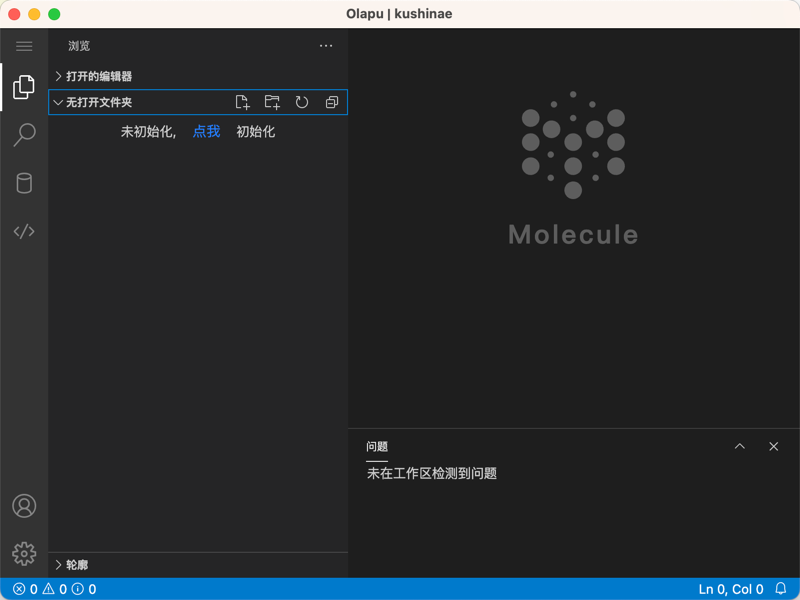

# Olapu

Olapu is a code generation solution designed with programmers in mind.

It can help us generate such as: Java entity class, Controller, Service, Dao, Repository... Help us quickly generate CRUD\Page Search API, reduce repetitive work in development, free our hands and let us focus on business more energy and time development.

## Getting started

### configure

- Initialize the database

execution [database initialization script](./sql/init.sql)

- configure your database connection

Editor [API service configuration file](./olapu-api/src/main/resources/application.yaml) 

```yaml
spring:
  datasource:
    driver-class-name: com.mysql.cj.jdbc.Driver # your data source driver
    url: jdbc:mysql://127.0.0.1:3306/olapu # your data source jdbc
    username: root # your data source username
    password: 123456 # your data source password
server:
  servlet:
    context-path: /api # global resource pre path
```

### build

#### backend service

##### build

```shell
cd ./olapu-api
gradle bootJar
```

##### deploy

```shell
java -jar ./olapu-api/build/libs/olapu-api-1.0-SNAPSHOT.jar
```


#### frontend service

##### build

```shell
cd ./console
yarn build
```

After building, your static resources will be in the `consoledist` directory, you can use `nginx` or other static resource agents to access it,

If you want to `local start`

```shell
cd ./console
yarn
yarn start
```

Or you want to use `Application` to launch

```shell
cd ./console
yarn
yarn start
yarn window
```

- preview



# Timeline

I'm actively developing this project, I can't push it anytime soon due to work, but I'm keeping active commits every day

# License

[Apache License, Version 2.0](https://www.apache.org/licenses/LICENSE-2.0)

# Thank you

- Thanks to `JetBrains` for their help with this project

